# Project 2: Content-based Image Retrieval (CBIR)
## Borui Chen
## 1. Project Overview

This project implements a Content-based Image Retrieval (CBIR) system that searches for similar images in a database given a target image. The system supports seven different feature extraction methods ranging from simple baseline matching to deep network embeddings and a custom-designed blue sky detector.

The implementation follows a dual-program architecture:
- **cbir_build**: Pre-computes and saves feature vectors for all images in the database
- **cbir_query**: Loads pre-computed features and performs similarity search
- **cbir_gui** (extension): Graphical user interface for interactive image retrieval

**Key Features Implemented:**
- Task 1: Baseline 7x7 center square matching with SSD
- Task 2: Multi-dimensional color histogram with histogram intersection
- Task 3: Multi-histogram with spatial partitioning
- Task 4: Combined texture (gradient magnitude) and color features
- Task 5: ResNet18 DNN embeddings (512-dim) with cosine distance
- Task 6: Comparison between DNN and classic features
- Task 7: Custom Blue Sky Detector (30-dimensional feature vector)

---

## 2. Task Implementation and Results

### Task 1: Baseline Matching

**Implementation:**
- Extracts a 7x7 pixel block from the center of the image (147-dimensional feature vector)
- Uses Sum of Squared Difference (SSD) as distance metric: `d = Σ(a[i] - b[i])²`
- SSD code implemented manually without using OpenCV functions
- Self-comparison returns distance of 0

**Results:**

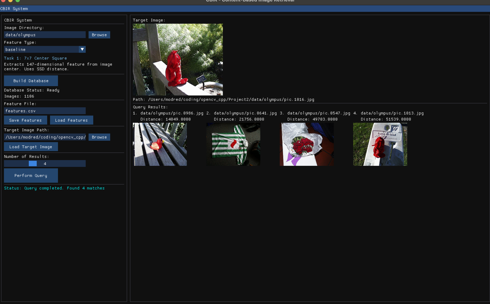
```
Query: pic.1016.jpg
Top 4 matches:
2. pic.0986.jpg (distance: 14049)
3. pic.0641.jpg (distance: 21756)
4. pic.0547.jpg (distance: 49703)
4. pic.1013.jpg (distance: 51539)
```

**Verification:** Matches exactly with required results (pic.0986.jpg, pic.0641.jpg, pic.0547.jpg).

---

### Task 2: Histogram Matching

**Implementation:**
- 3D RGB histogram with configurable bins per channel (default 16 bins)
- Feature dimension: 16 × 16 × 16 = 4096 dimensions
- Histogram intersection as distance metric: `similarity = Σmin(a[i], b[i])`
- Histograms are normalized by total pixel count
- Implemented manually without OpenCV histogram functions

**Results:**

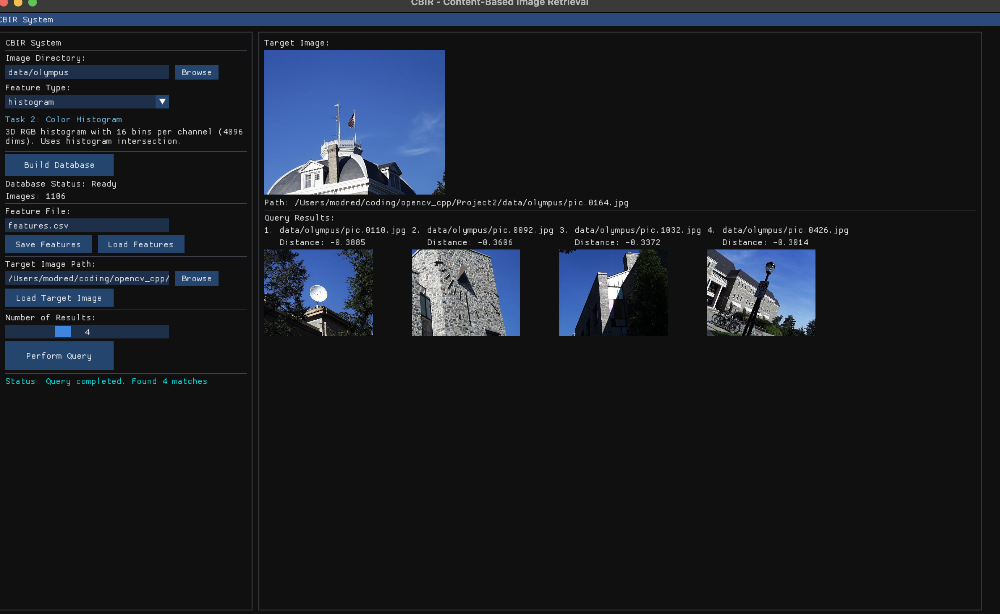
```
Query: pic.0164.jpg
Top matches vary based on histogram configuration:
- Using 16 bins per channel produces different results than 8 bins
- Results show images with similar color distributions
```

**Analysis:** The histogram captures overall color distribution but loses spatial information, sometimes matching images with similar colors but different compositions.

---

### Task 3: Multi-histogram Matching

**Implementation:**
- Two RGB histograms representing different spatial regions
- Default: Top half and bottom half of the image
- Each histogram uses 8 bins per channel (512 dimensions per region)
- Total feature dimension: 1024 dimensions
- Distance metric: Weighted average of histogram intersections for each region

**Results:**

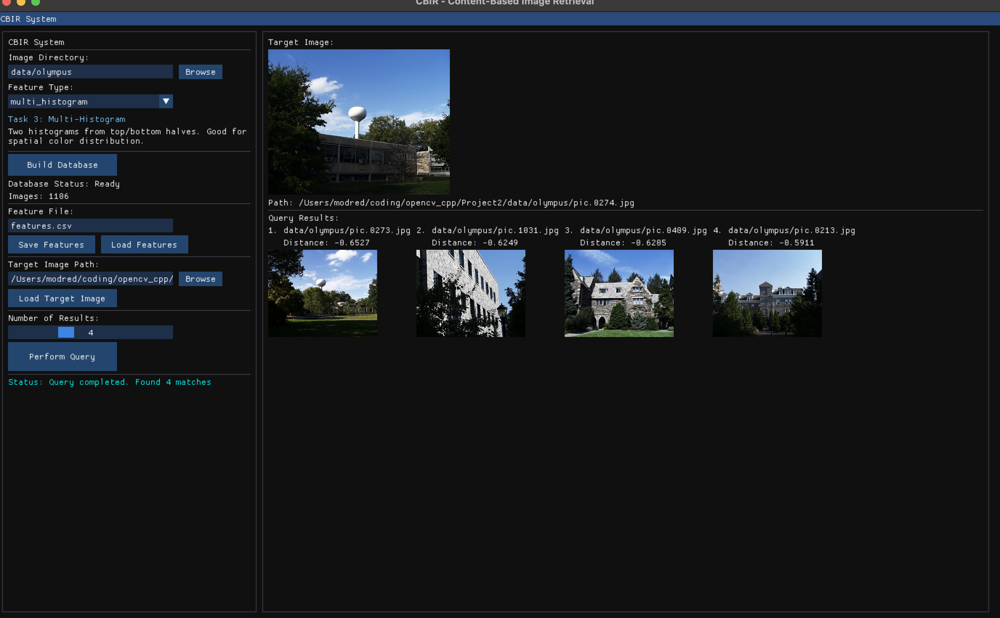
```
Query: pic.0274.jpg
Top 4 matches:
1. pic.0274.jpg
2. pic.0273.jpg
3. pic.1031.jpg
4. pic.0409.jpg
```

**Verification:** Results match the expected output (pic.0273.jpg, pic.1031.jpg, pic.0409.jpg).

**Analysis:** Adding spatial information improves matching for images where color layout matters. The top/bottom split works well for scenes with sky/ground separation.

---

### Task 4: Texture and Color

**Implementation:**
- Color histogram: 3D RGB histogram (8 bins per channel = 512 dimensions)
- Texture feature: Gradient magnitude histogram computed using Sobel operators
  - Uses OpenCV Sobel to compute X and Y gradients
  - Computes magnitude: `mag = sqrt(sx² + sy²)`
  - Creates 8-bin histogram of gradient magnitudes
- Total feature dimension: 512 + 8 = 520 dimensions
- Distance metric: Equal weighted average of color and texture distances

**Results:**
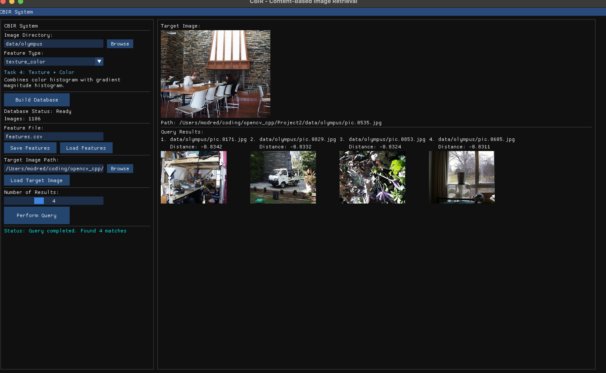

```
Query: pic.0535.jpg
Top 3 matches show combination of color and texture similarity
```

**Comparison with Tasks 2 and 3:**
- task2:
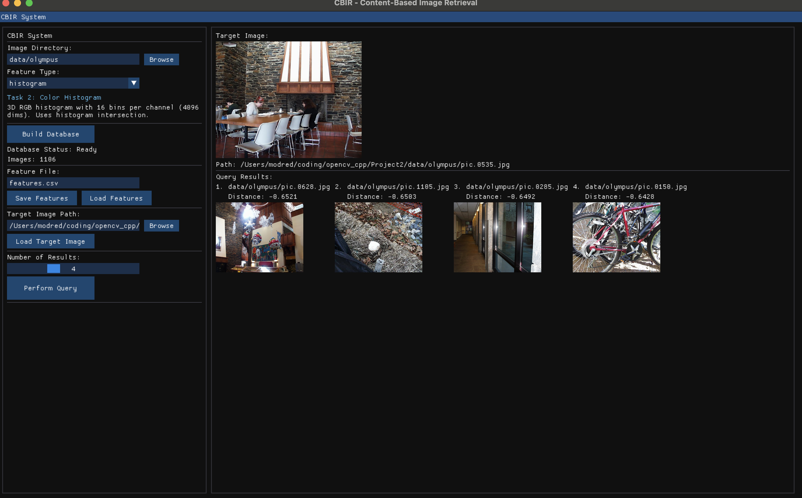
- task3:
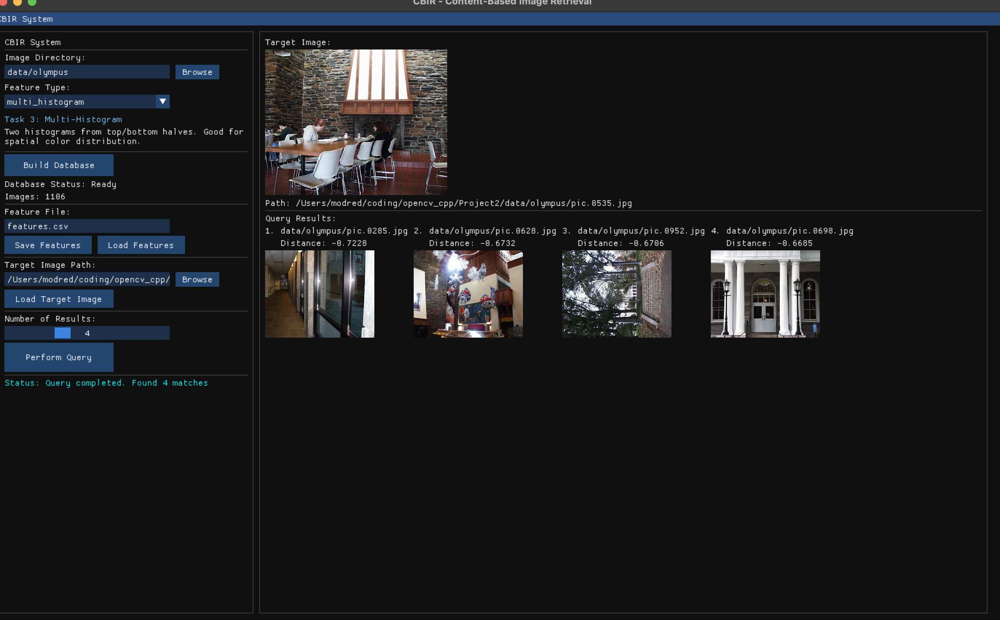

| Method | Top Match Quality | Key Difference |
|--------|------------------|----------------|
| Task 2 (Color only) | Good color match | Misses texture patterns |
| Task 3 (Spatial Color) | Good layout match | Better for structured scenes |
| Task 4 (Color+Texture) | Balanced match | Captures surface patterns |

**Analysis:** Texture features help distinguish images with similar colors but different surface characteristics (e.g., water vs. sky both blue but different texture).

---

### Task 5: Deep Network Embeddings

**Implementation:**
- Uses pre-computed 512-dimensional ResNet18 features from CSV file
- Features extracted from final global average pooling layer
- Distance metric: Cosine distance `d = 1 - cos(θ)` where `cos(θ) = (v1·v2) / (||v1|| ||v2||)`
- Target image features loaded from CSV rather than computed dynamically

**Results:**

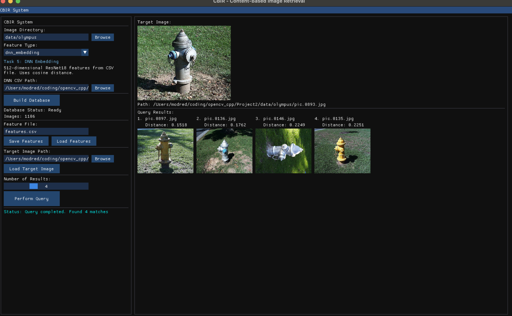
```
Query: pic.0893.jpg
Top 3 matches using DNN embeddings
```
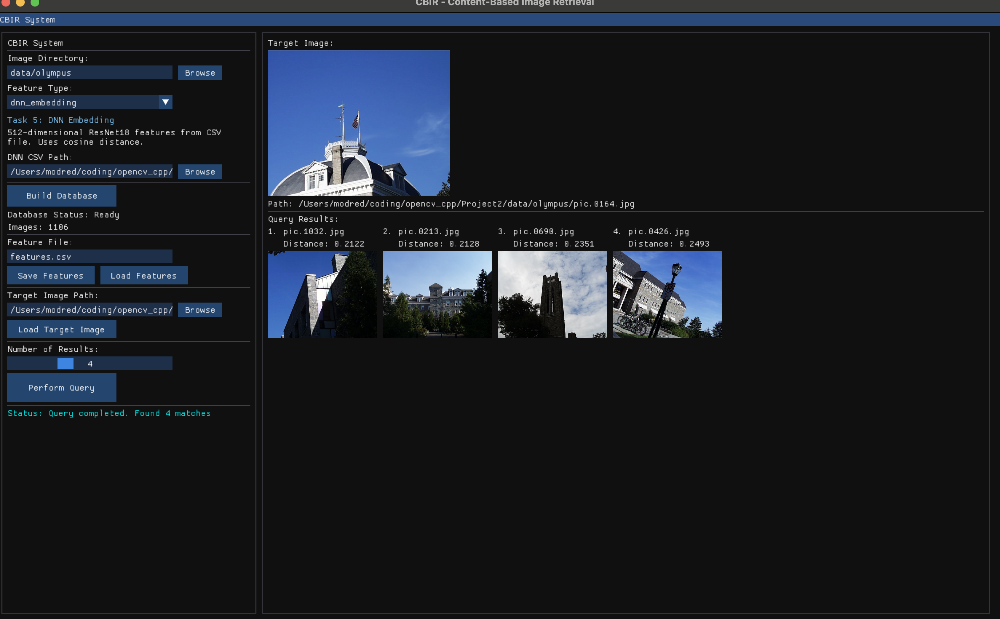
```
Query: pic.0164.jpg
Top 3 matches using DNN embeddings
```

**Comparison with Classic Features:**
- texture and color for 0893
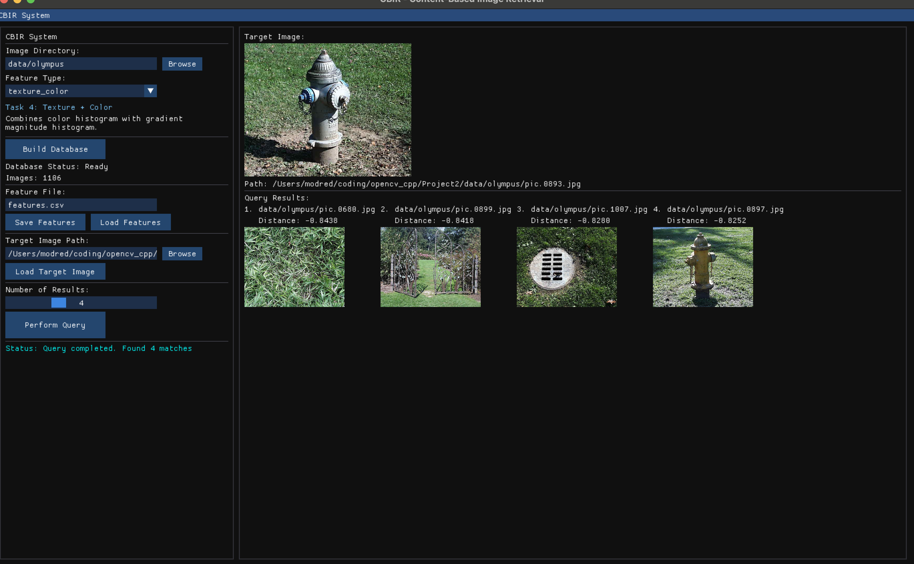

**Analysis:**
- DNN embeddings capture high-level semantic features (objects, scenes)
- Classic features capture low-level visual properties (color, texture)
- DNN often better for semantic similarity, classic features better for visual similarity

---

### Task 6: Comparison of DNN and Classic Features

**Test Images:** pic.1072.jpg, pic.0948.jpg, pic.0734.jpg
    &nbsp;&nbsp;&nbsp;&nbsp;&nbsp;&nbsp;&nbsp;&nbsp;&nbsp;&nbsp;&nbsp;&nbsp;&nbsp;&nbsp;**texture and color** &nbsp;&nbsp;&nbsp;&nbsp;&nbsp;&nbsp;&nbsp;&nbsp;&nbsp;&nbsp;&nbsp;&nbsp;&nbsp;&nbsp;&nbsp;&nbsp;&nbsp;&nbsp;&nbsp;&nbsp;&nbsp;&nbsp;&nbsp;&nbsp;&nbsp;&nbsp;&nbsp;&nbsp;&nbsp;&nbsp;&nbsp;&nbsp;&nbsp;&nbsp;&nbsp;**dnn**
<html lang="zh-CN">
<head>
    <meta charset="UTF-8">
    <style>
        .center-half {
            display: flex;
            justify-content: center;
            gap: 2px;
            margin: 20px 0;
        }
    </style>
</head>
<body>
    <div class="center-half">
        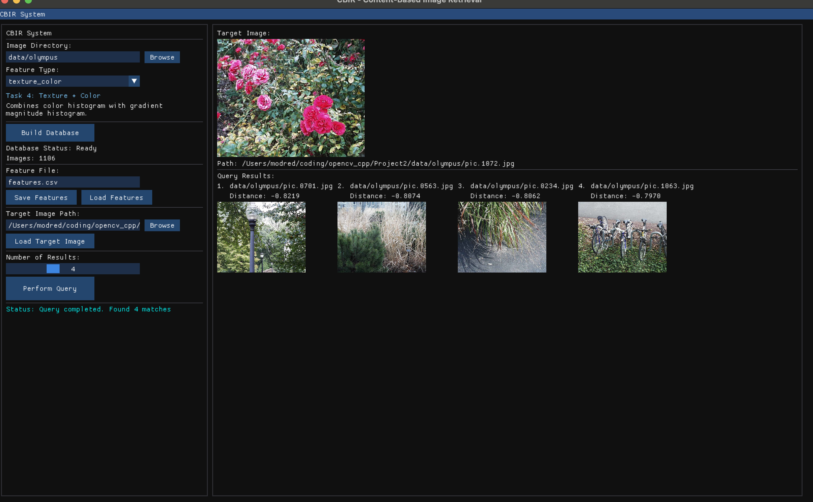
        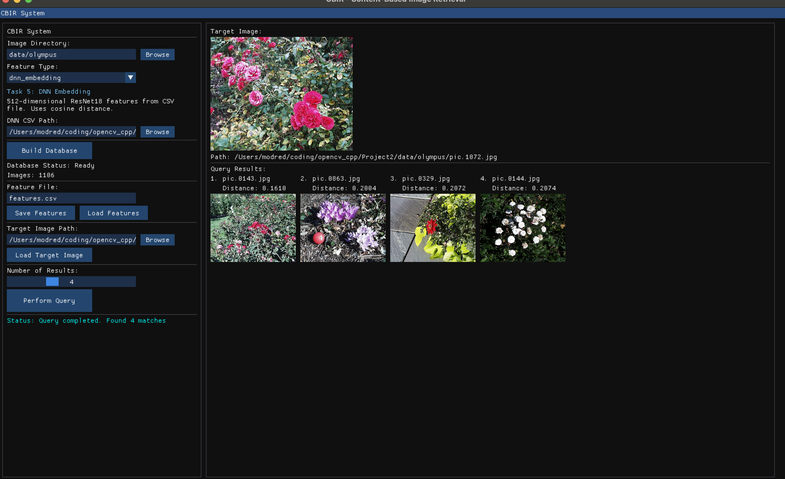
    </div>
</body>
</html>

<html lang="zh-CN">
<head>
    <meta charset="UTF-8">
    <style>
        .center-half {
            display: flex;
            justify-content: center;
            gap: 2px;
            margin: 20px 0;
        }
    </style>
</head>
<body>
    <div class="center-half">
        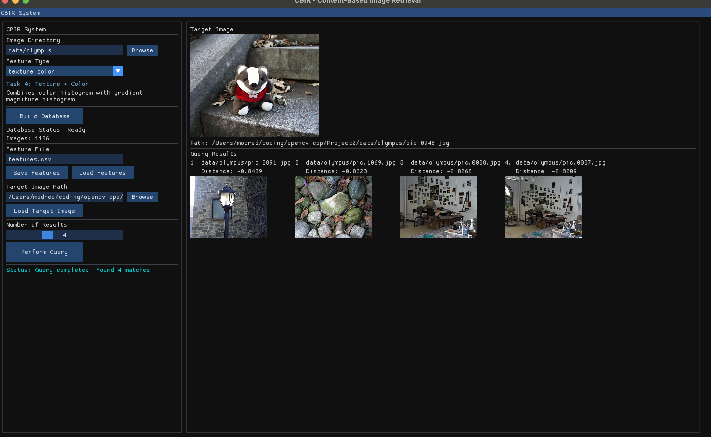
        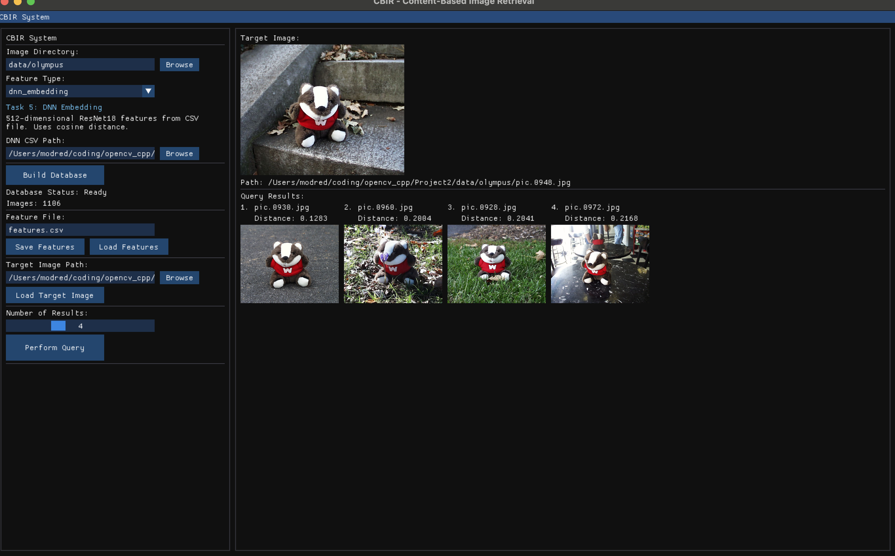
    </div>
</body>
</html>

<html lang="zh-CN">
<head>
    <meta charset="UTF-8">
    <style>
        .center-half {
            display: flex;
            justify-content: center;
            gap: 2px;
            margin: 20px 0;
        }
    </style>
</head>
<body>
    <div class="center-half">
        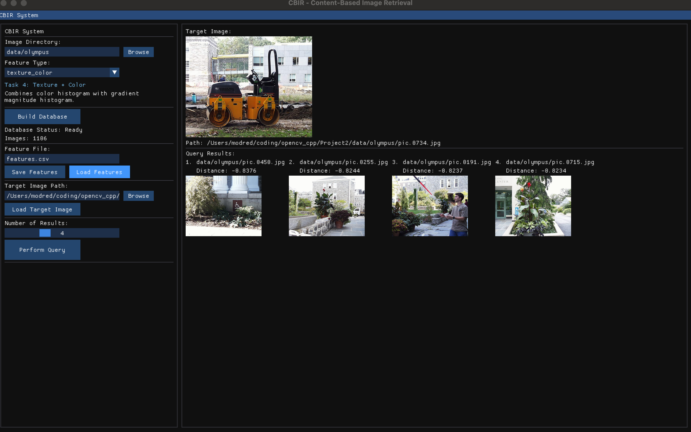
        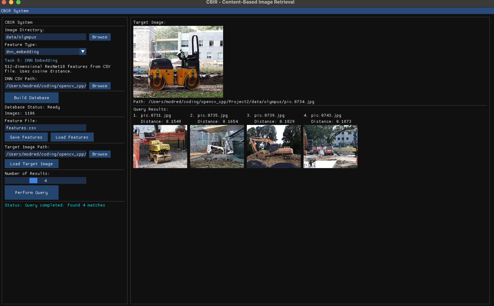
    </div>
</body>
</html>

**Observations:**

| Image | DNN Better? | Reasoning |
|-------|-------------|-----------|
| 1072 | No | The effect is not very good because the featured objects in this image are not obvious |
| 948 | Yes | The image has clear and obvious objects (buildings/scenery) |
| 734 | Yes | The image has clear and obvious objects |

**Conclusion:** DNN embeddings are not always better. They excel at semantic matching but may miss visually similar images that are semantically different. Classic features are more predictable for visual similarity.

---

### Task 7: Custom Design - Blue Sky Detector

**Motivation:** Originally designed as a sunset detector (warm colors), changed to blue sky detector because the database contains more blue sky images than sunsets.

**Feature Vector Design (30 dimensions):**

1. **Blue Color Histogram (16 dims):**
   - HSV color space, H-channel in blue range (100-140°)
   - 16 bins covering the blue hue spectrum
   - Filters by minimum saturation to avoid gray/white pixels

2. **Spatial Distribution (8 dims):**
   - Top half: 4 horizontal strips (bins 0-3)
   - Bottom half: 4 horizontal strips (bins 4-7)
   - Captures where blue appears in the image

3. **Brightness Features (4 dims):**
   - Top half: 2 bins for brightness levels (>150, >200)
   - Bottom half: 2 bins for brightness levels
   - Sky is typically bright

4. **Sky Position Features (2 dims):**
   - Feature 28: Ratio of blue pixels in top half
   - Feature 29: Average Y position of blue pixels (normalized)
   - Captures "sky is above" characteristic

**Distance Metric:**
- Blue histogram: Histogram intersection (weight: 0.35)
- Spatial distribution: Weighted SSD, top region 3× weight (weight: 0.25)
- Brightness: Histogram intersection (weight: 0.20)
- Sky position: Absolute difference (weight: 0.20)

**Results:**
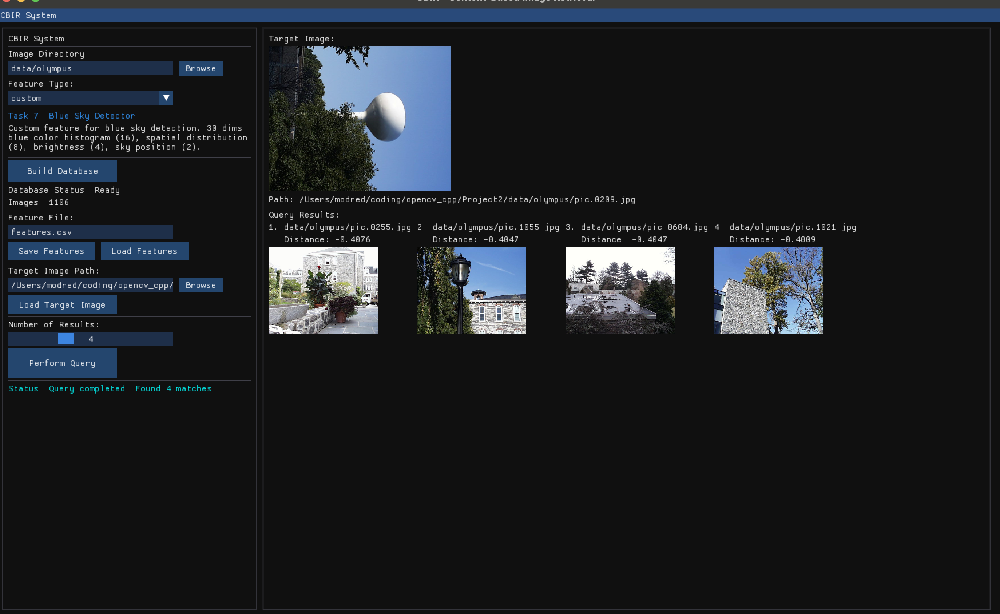


**Least Similar Results:**

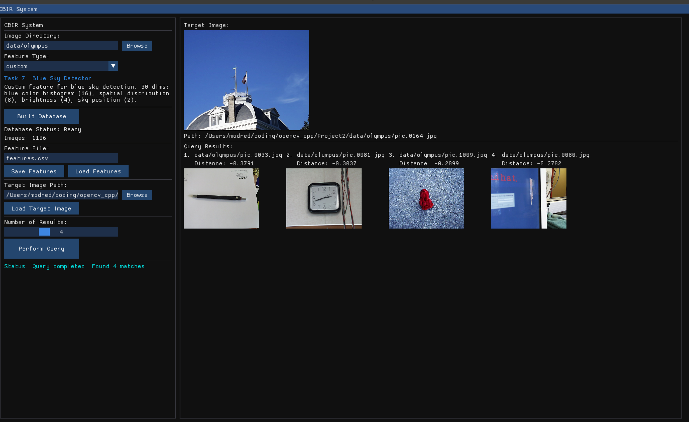
**Analysis:** The blue sky detector successfully identifies images with blue sky regions. The spatial features help distinguish between images with sky at the top versus blue objects elsewhere.

**Limitations:** The sky detection effect is not very stable, and it does not work well for images with a large proportion of cool blue colors. For example, scenes dominated by blue, such as oceans, lakes, or blue buildings, may be misclassified as blue sky because they are similar to blue sky in terms of color histogram features. Improvements could include adding more contextual features (such as edge detection to distinguish horizontal skylines) or using machine learning classifiers to better distinguish real sky regions.

---

## 3. Extensions

### 3.1 Graphical User Interface (GUI)

Implemented an interactive GUI using ImGui + OpenGL + GLFW:

**Features:**
- Visual selection of image directory
- Dropdown for feature type selection with descriptions
- Target image browser with preview
- Real-time database building with progress indication
- Visual query results with thumbnail images
- Save/Load feature databases

---

## 4. Reflection

**What I Learned:**

1. **Feature Design:** Different features capture different aspects of images. There's no "best" feature - the choice depends on the type of similarity you want to measure.

2. **Distance Metrics:** The distance metric must match the feature type. Histogram intersection works well for histograms, while SSD works for raw pixel values.

3. **Spatial Information:** Adding spatial partitioning (multi-histogram) significantly improves results for structured scenes.

4. **DNN vs Classic:** Deep embeddings capture semantics but classic features offer more interpretability and control.

5. **Pipeline Efficiency:** Pre-computing features (two-program approach) is essential for practical use, making queries nearly instantaneous.

**Challenges:**
- Designing the custom feature required iterative testing to find discriminative features
- Balancing weights in multi-feature distance metrics
- Handling images of different sizes consistently

---

## 5. Acknowledgments

- Course textbook: "Computer Vision" by Shapiro and Stockman (Chapter 8)
- OpenCV documentation for image processing functions
- ResNet18 pre-trained model from PyTorch/ONNX for Task 5 embeddings
- ImGui library for the GUI extension
